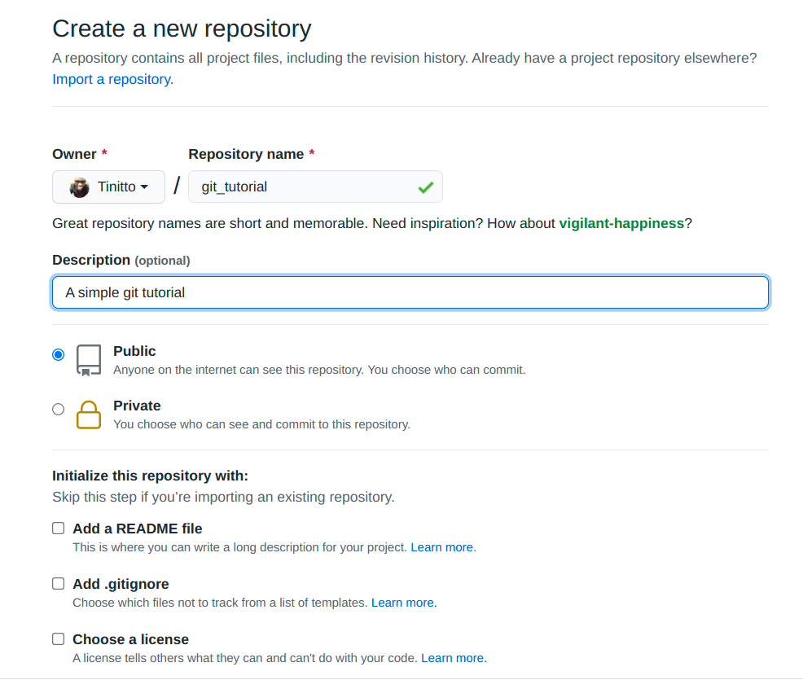

# git Tutorial

This is a tutorial on how to use git. I don't think it is comprehensive enough to be called documentation and that is intentional.

## Purpose

This is just a tutorial of the majority of tasks people use git for. The more complicated things can be searched for on [Google](https://www.google.com/search?q=git).

## What is the Purpose of git

git is what we call a version control software (VCS). In simple terms, it is used to track changes we make to the source code. Tracking these changes enables us to rollback if we ever want to. That is sort of like an 'un-do' for software.

It also is helpful in ensuring that we don't keep changing versions of code that are being used by others, much as development is ongoing. Otherwise we would have to keep each version in say a different folder. However, by using git branches in the same folder, each branch can be viewed a separate version of the code. Any one can then take the version they wish to use by writing simple git commands.

## How to Install git

- For windows, go to the [official downloads page](https://git-scm.com/download/win)
- For linux, I will focus on ubuntu. For other linux flavours, visit the [official git linux download instructions page](https://git-scm.com/download/linux)

  ```sh
  sudo add-apt-repository ppa:git-core/ppa
  sudo apt update
  sudo apt install git
  ```

## A Basic workflow in git

The most basic workflow follows the following rules:

- Every new feature should have a separate branch aptly named. It is preferable to have a uniform prefix for all feature branches e.g. 'ft-' i.e. 'ft-home-page'
- Every feature branch should branch off from the main branch of development. It is then worked on and completed then a pull request is created on github, gitlab or bitbucket.
- After the pull request is reviewed by fellow contributors, it is merged into the main branch.

### Example repository

Note: _I am using ubuntu linux commands here_

- Create an empty folder on your local computer. Let's call it git_tutorial

  ```sh
  mkdir git_tutorial
  ```

- Enter the directory and change it to a git repository

  ```sh
  cd git_tutorial
  git init
  ```

- Create a new branch specific to creating the README file

  ```sh
  git branch ft-readme-file
  ```

- Enter that new branch and start editing the code

  ```sh
  git checkout ft-readme-file
  ```

- Create a README.md file in that folder

  ```sh
  touch README.md
  ```

- Add some content to that README.md file. You can use your favorite code editor. I personally use [Visual Studio Code](https://code.visualstudio.com/). For now, I will use the command line.

  ```sh
  printf '%s\n%s' "# Hello Git" "This is a sample git repository" >> README.md
  ```

- Let git know that you are done with your edits and that you wish to move on to other things.

  ```sh
  git add README.md
  git commit -m "Added a README.md file"
  ```

- Add another change to the README.md file. Let's say we add sn acknowledgments section

  ```sh
  printf '\n\n%s\n%s' "## Ackowledgments" "This was obtained from [SopherApps](https://github.com/sopherapps)" >> README.md
  ```

- Again, let git know that you are done with your edits.

  ```sh
  git add README.md
  git commit -m "Added acknowledgements to the README.md file"
  ```

- Create a repository on [github](https://github.com) and copy the github url. Make sure when creating the repository, you leave all checkboxes unchecked

  |  |
  | -------------------------------------------------------------------------------------------------- |
  | _Click the 'new repository' link from the '+' in the navbar_                                       |

  |  |
  | ------------------------------------------------------------------------------------------------------ |
  | _Fill in the name of the repository and a brief description_                                           |

  |  |
  | ---------------------------------------------- |
  | _Copy the git URL_                             |

- Connect the local repository to the repository on github. Name the connection 'origin'. Assuming the git URL copied above is `https://github.com/learn-along/git_tutorial.git`, we can connect the two repositories by:

  ```sh
  git remote add origin https://github.com/learn-along/git_tutorial.git
  ```

- Go back to the master branch of your local repository

  ```sh
  git checkout master
  ```

- Push that master branch to the repository on github so that the github repository also gets the master branch. The master branch will be treated as the main branch.

  ```sh
  git push origin master
  ```

- Go back to the `ft-readme-file` branch and also push it

  ```sh
  git checkout ft-readme-file
  git push origin ft-readme-file
  ```

- Go to your github repository and create a pull request

  |                 |
  | ------------------------------------------------------------------------------------------------------- |
  | _Click the 'Compare and Pull Request' link. You can also find another such option by clinking branches_ |

  |                                                              |
  | ---------------------------------------------------------------------------------------------------------------------------------------- |
  | _Add details to the pull request. Ensure the title is short and desciptive of the Changes made. Add a list of the changes made and why._ |

  |                                                                                                  |
  | ------------------------------------------------------------------------------------------------------------------------------------------------------ |
  | _The main maintainer will then merge the pull request when all the necessary reviewers have reviewed. You will need to invite any reviewers you need._ |

  |                    |
  | ------------------------------------------------------------------------------------- |
  | _The one who merges will delete the feature branch after the pull request is merged._ |

- To copy that repository on another computer, just clone the github repository

  ```bash
  git clone https://github.com/learn-along/git_tutorial.git
  ```

- In case other collaborators have updated the master branch, update your local repository by pulling the changes from the github master

  ```sh
  git pull origin master
  ```

- Then update your feature branch from master

  ```sh
  git checkout ft-readme-file
  git merge master
  ```
